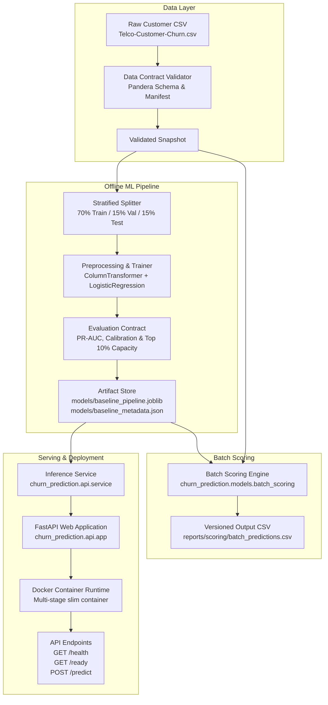

# Customer Churn Prediction System

A production-oriented machine learning product designed to identify IBM Telco customers at risk of churn. Built with software engineering rigor, explicit data contracts, reproducible pipelines, batch scoring, FastAPI serving, and containerization.

---

## 📌 Project Overview

This repository demonstrates an end-to-end Machine Learning System built as a production-quality product. Rather than focusing solely on offline modeling in Jupyter notebooks, it implements a robust, modular, and maintainable pipeline covering data contract validation, stratified baseline training, probability calibration, capacity-constrained batch scoring, REST API serving, and containerized deployment.

### Key Highlights
- **Data Contract Enforcement**: Ingestion validation using Pandera schemas and custom domain checks (rejecting duplicate IDs, invalid types, and malformed fields).
- **Reproducible Pipelines**: scikit-learn `Pipeline` and `ColumnTransformer` models with strict split protocols (70% train, 15% val, 15% test) avoiding data leakage.
- **Business-First Evaluation**: Optimized for Precision-Recall AUC (PR-AUC) and capacity-constrained campaign thresholds (top 10% target allocation) rather than naive 0.5 accuracy.
- **Idempotent Batch Scoring**: Versioned batch scoring pipeline producing deterministic customer worklists and quarantining malformed data without partial writes.
- **REST Inference API**: FastAPI application serving single-customer risk predictions with correlation ID tracing, health/readiness probes, and error handling.
- **Production Containerization**: Multi-stage, non-root Docker runtime with deterministic dependency locks (`uv.lock`) and configurable environment variables.

---

## 🏗 System Architecture



---

## 📂 Repository Structure

```text
.
├── Dockerfile                  # Multi-stage production container setup
├── .dockerignore               # Docker build context exclusions
├── AGENTS.md                   # Repository engineering rules & guidelines
├── SYSTEM_DESIGN.md            # Detailed system design specification
├── TASKS.md                    # Milestone-based delivery tracking
├── pyproject.toml              # Project configuration & dependencies
├── uv.lock                     # Deterministic dependency lockfile
├── configs/                    # Versioned YAML configurations
│   ├── data_contract.yaml
│   ├── evaluation.yaml
│   ├── serving.yaml
│   └── training.yaml
├── models/                     # Persisted model artifacts (ignored by Git)
│   ├── baseline_metadata.json
│   └── baseline_pipeline.joblib
├── reports/                    # Generated metrics, plots & quarantine outputs
│   ├── evaluation/
│   ├── quarantine/
│   └── scoring/
├── scripts/                    # Thin operator entry points
│   ├── run_eda.py
│   ├── train_baseline.py
│   ├── evaluate_baseline.py
│   ├── validate_scoring_input.py
│   ├── run_batch_scoring.py
│   └── run_api.py
├── src/churn_prediction/       # Main Python application package
│   ├── api/                    # FastAPI app, schemas, config & service
│   ├── data/                   # Contract schema & Pandera validation
│   ├── eda/                    # Analysis & plotting pipeline
│   ├── evaluation/             # Metrics, calibration & capacity evaluation
│   ├── features/               # scikit-learn preprocessing pipeline
│   └── models/                 # Model trainer, serialization & batch engine
├── tests/                      # Comprehensive test suite
│   ├── contract/               # Input contract & API schema tests
│   ├── integration/            # Pipeline & container integration tests
│   └── unit/                   # Modular unit tests
└── infra/                      # Infrastructure & container configs
    └── Dockerfile
```

---

## ⚡ Quick Start & Development Workflow

### Prerequisites
- Python 3.11+
- [uv](https://docs.astral.sh/uv/) dependency manager
- Docker (optional, for containerized serving)

### 1. Environment Setup

```bash
# Clone the repository
git clone https://github.com/avisorghosh/TelcoCustomerChurn.git
cd TelcoCustomerChurn

# Create locked development environment
uv sync --locked
```

### 2. Pipeline Execution Commands

Run the complete pipeline from data validation to local API serving:

```bash
# 1. Validate raw data against data contract
uv run python scripts/validate_scoring_input.py --input-path Telco-Customer-Churn.csv

# 2. Run exploratory data analysis and export plots
uv run python scripts/run_eda.py

# 3. Train baseline model pipeline and persist artifacts
uv run python scripts/train_baseline.py

# 4. Evaluate baseline model performance and generate evaluation metrics/plots
uv run python scripts/evaluate_baseline.py

# 5. Execute batch scoring pipeline
uv run python scripts/run_batch_scoring.py

# 6. Launch local FastAPI inference service
uv run python scripts/run_api.py --host 127.0.0.1 --port 8000
```

---

## 📈 MLflow Experiment Tracking & Model Registry

The system integrates [MLflow](https://mlflow.org/) for experiment tracking, run lineage, data manifest logging, Git revision tracking, artifact storage, model signatures, and local model registry workflows.

### 1. Storage & Configuration
- **Experiment Store**: Recorded locally under `./mlruns/` (ignored by Git).
- **Tracking URI**: Defaults to `file:./mlruns`, configurable via `configs/training.yaml` or `MLFLOW_TRACKING_URI` environment variable.
- **Experiment Name**: Defaults to `telco_customer_churn` (`MLFLOW_EXPERIMENT_NAME`).
- **Registered Model Name**: Defaults to `telco_churn_model` (`MLFLOW_REGISTERED_MODEL_NAME`).

### 2. Running Tracked Experiments
Training automatically logs runs and registers candidate models to MLflow:

```bash
# Execute training pipeline (logs lineage, data checksum, git revision, model signature, and artifacts)
uv run python scripts/train_baseline.py

# Optionally disable MLflow tracking during training if desired
uv run python scripts/train_baseline.py --no-mlflow
```

### 3. Inspecting Experiments & Models via MLflow UI
To start the local MLflow tracking server and UI:

```bash
uv run mlflow ui --port 5000
```

Open `http://127.0.0.1:5000` in your web browser to:
- **Inspect Runs & Lineage**: View parameters, random seed, training metrics (`train_accuracy`, `val_accuracy`, `test_accuracy`), split counts, dataset SHA-256 checksum (`data_checksum`), and Git SHA (`git_commit`).
- **Inspect Model Signatures**: View inferred input feature schema and output predictions for the logged scikit-learn pipeline.
- **Inspect Artifacts**: Download or review saved `.joblib` pipelines, `metadata.json`, and evaluation reports/plots.
- **Manage Local Registry**: View registered model versions under the **Models** tab (`telco_churn_model`) and load versioned models for scoring.

---


## 🐳 Docker Container Workflow

The service is packaged into a production-ready, multi-stage Docker container built on `python:3.11-slim` running as a non-root user (`appuser` UID 10001).

### Build Image

```bash
docker build -t telco-churn-api:latest .
```

### Run Container

```bash
docker run -d \
  --name churn-api \
  -p 8000:8000 \
  -e CHURN_DECISION_THRESHOLD=0.50 \
  telco-churn-api:latest
```

### Environment Variable Configuration

The container and API service support flexible runtime configuration:

| Variable | Default | Description |
| --- | --- | --- |
| `CHURN_API_HOST` / `HOST` | `0.0.0.0` | Binding host address for FastAPI server |
| `CHURN_API_PORT` / `PORT` | `8000` | Port number to expose service on |
| `CHURN_MODEL_DIR` | `/app/models` | Directory path containing model artifacts |
| `CHURN_PIPELINE_FILENAME` | `baseline_pipeline.joblib` | Model pipeline filename |
| `CHURN_METADATA_FILENAME` | `baseline_metadata.json` | Model metadata filename |
| `CHURN_DECISION_THRESHOLD` | `0.50` | Prediction probability threshold for class assignment |
| `CHURN_MODEL_VERSION` | Metadata version | Model version string returned in prediction responses |
| `CHURN_CONFIG_PATH` | `configs/serving.yaml` | Path to custom YAML serving config |

### Stop Container

```bash
docker stop churn-api
docker rm churn-api
```

---

## 🚀 API Endpoint Specifications

### 1. Health Probe (`GET /health`)
Returns general service status and model loading state.

```bash
curl http://localhost:8000/health
```

**Response:**
```json
{
  "status": "ok",
  "model_loaded": true
}
```

### 2. Readiness Probe (`GET /ready`)
Returns `200 OK` when ready to serve inference requests, or `503 Service Unavailable` if model artifact is missing/unloaded.

```bash
curl http://localhost:8000/ready
```

**Response:**
```json
{
  "status": "ready",
  "model_loaded": true
}
```

### 3. Prometheus Metrics Endpoint (`GET /metrics`)
Exposes Prometheus operational and model performance metrics.

```bash
curl http://localhost:8000/metrics
```

---

## 🔍 System Observability, Monitoring & Operations

### Structured Privacy-Safe Logging
- Emits structured JSON log lines containing `timestamp`, `level`, `event`, `correlation_id`, `model_version`, and context.
- **Privacy Safety**: Automatically redacts sensitive fields (`customerID`, `gender`, raw features payload, PII).

### Prometheus Metrics
- **API Metrics**: `telco_churn_api_requests_total`, `telco_churn_api_request_duration_seconds`, `telco_churn_predictions_total`, `telco_churn_prediction_failures_total`.
- **Batch Scoring Metrics**: `telco_churn_batch_scoring_records_total` (accepted/rejected), `telco_churn_batch_scoring_validation_failures_total`, `telco_churn_batch_scoring_failures_total`.
- **Model Lifecycle**: `telco_churn_model_loads_total`, `telco_churn_model_load_failures_total`.

### Quality & Data Drift Reporting
- **Operational Quality Report**: Generated during batch validation, summarizing accepted/rejected records, schema check violations, duplicate records, and per-column missing values (`reports/quality/operational_quality_report.json`).
- **Data Drift Report**: Compares scoring data against training reference dataset using Population Stability Index (PSI) and Kolmogorov-Smirnov (KS) tests (`reports/drift/drift_report.json`).
  ```bash
  uv run python scripts/run_drift_report.py
  ```

### Operational Runbook & Alert Policy
- **Grafana Dashboard Template**: `docs/dashboards/grafana_dashboard.json` & `docs/dashboards/README.md`.
- **Operational Runbook**: `docs/runbooks/operational_runbook.md` (triage for service startup, quarantine remediation, model load errors, drift alerts).
- **Alert Policy**: `docs/alert_policy.md` (P1/P2 alert thresholds for API errors, validation failure spikes, significant drift).

### 4. Prediction Endpoint (`POST /predict`)
Predicts churn risk probability and binary risk class for a single customer snapshot.

#### Example Request:
```bash
curl -X POST "http://localhost:8000/predict" \
  -H "Content-Type: application/json" \
  -H "X-Correlation-ID: req-abc-12345" \
  -d '{
    "customerID": "7590-VHVEG",
    "gender": "Female",
    "SeniorCitizen": 0,
    "Partner": "Yes",
    "Dependents": "No",
    "tenure": 12,
    "PhoneService": "Yes",
    "MultipleLines": "No",
    "InternetService": "DSL",
    "OnlineSecurity": "Yes",
    "OnlineBackup": "No",
    "DeviceProtection": "No",
    "TechSupport": "Yes",
    "StreamingTV": "No",
    "StreamingMovies": "No",
    "Contract": "One year",
    "PaperlessBilling": "No",
    "PaymentMethod": "Mailed check",
    "MonthlyCharges": 55.85,
    "TotalCharges": 670.20
  }'
```

#### Example Response:
```json
{
  "churn_probability": 0.1245,
  "predicted_class": 0,
  "model_version": "1.0.0",
  "correlation_id": "req-abc-12345",
  "prediction_timestamp": "2026-07-29T19:54:00.000000+00:00"
}
```

---

## 📊 Measured Baseline Model Results

Evaluated on an untouched holdout test partition ($N = 1,057$, 26.5% churn prevalence):

| Metric | Measured Value | Description |
| --- | --- | --- |
| **PR-AUC (Primary)** | `0.6437` | Area under Precision-Recall Curve (ranking quality for churn class) |
| **ROC-AUC** | `0.8487` | Receiver Operating Characteristic AUC |
| **Brier Score** | `0.1361` | Mean squared probability error (calibration quality) |
| **Precision @ 10% Capacity** | `75.47%` | Precision when targeting the highest-risk 10% of customer base |
| **Recall @ 10% Capacity** | `28.57%` | Fraction of total churners captured within top 10% capacity |
| **Capacity Risk Threshold** | `0.6627` | Probability threshold for top 10% campaign capacity |
| **Accuracy @ 0.50 Threshold** | `79.85%` | Overall classification accuracy |

---

## 🧪 Testing Guidelines

The test suite covers unit tests for modules, data contract verification, batch scoring edge cases, and API integration.

```bash
# Run code formatting check
uv run ruff format --check .

# Run linter
uv run ruff check .

# Run full test suite with coverage report
uv run pytest

# Run focused unit tests
uv run pytest tests/unit -q
```

---

## 📄 License & Attribution

This project uses the public IBM Telco Customer Churn dataset for demonstration and portfolio purposes. Licensed under the MIT License.
