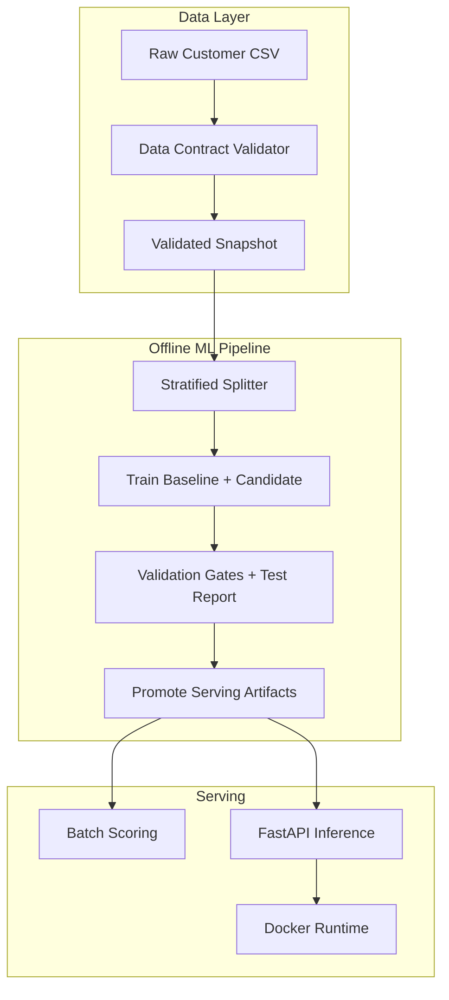
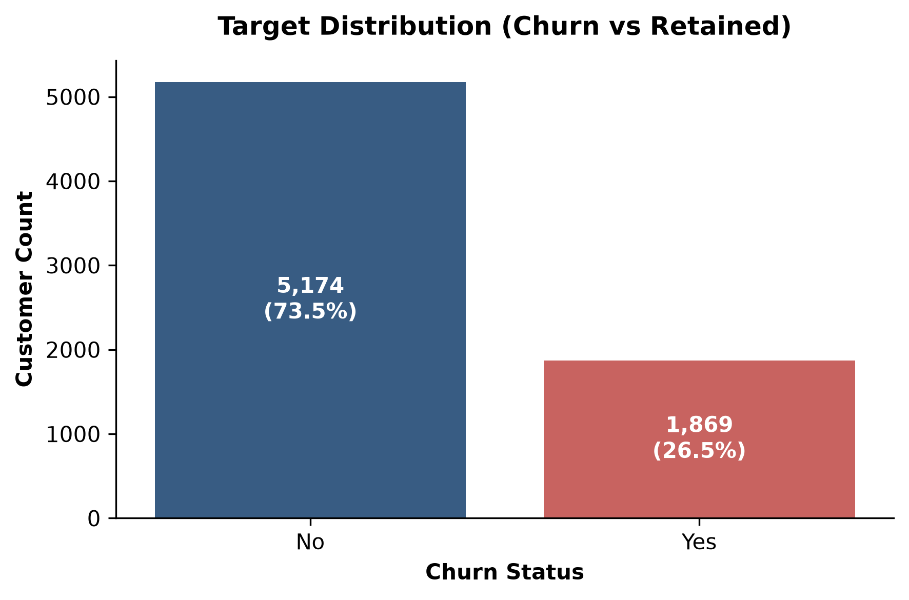

# Customer Churn Prediction System

Production-oriented churn risk scoring for IBM Telco-style customer snapshots: data contracts, reproducible training, capacity-aware evaluation, batch scoring, FastAPI serving, MLflow tracking, and containerized deployment.

This is a **portfolio / local-deployment** system. It is not a temporally validated production forecasting product.

---

## Project Overview

The repository implements an end-to-end ML product rather than a notebook-only model:

- Pandera data-contract validation with quarantine on failure
- Stratified 70/15/15 train/validation/test splits and sklearn `Pipeline` artifacts
- Business-first metrics (PR-AUC, top-10% capacity precision/recall, calibration/Brier)
- Validation-gated candidate comparison (sklearn `GradientBoostingClassifier` vs logistic regression)
- Idempotent batch scoring and a FastAPI single-record API
- MLflow lineage + local registry, Prometheus metrics, drift/quality reports

### Documentation Index

| Document | Purpose |
| --- | --- |
| [SYSTEM_DESIGN.md](SYSTEM_DESIGN.md) | Architecture and design rationale |
| [docs/model_card.md](docs/model_card.md) | Intended use, limitations, fairness, ops |
| [reports/evaluation/decision_record.md](reports/evaluation/decision_record.md) | Candidate selection decision record |
| [DEPLOYMENT.md](DEPLOYMENT.md) | Environment and deployment notes |
| [RELEASE.md](RELEASE.md) | Release rehearsal procedure |
| [ROLLBACK.md](ROLLBACK.md) | Model restore / rollback |

---

## Assumptions & Limitations

| Topic | Portfolio default |
| --- | --- |
| Prediction horizon | **Proxy** next-billing-cycle / weekly churn risk (dataset has no event timestamps) |
| Scoring cadence | Weekly batch scoring |
| Campaign capacity | Configurable; default **top 10%** (`configs/evaluation.yaml`) |
| Sensitive features | `gender` and `SeniorCitizen` excluded from predictors; fairness review only |
| Data provenance | Public IBM Telco Customer Churn CSV shipped for demo reproducibility |
| Deployment scope | Local Python + local Docker + local MLflow file store |
| Limitations | No out-of-time split; no real intervention outcomes in source data; auth/TLS/rate limits are deployment concerns |

Unsupported claims to avoid: causal treatment effects from the static CSV alone, production SLA guarantees without load tests, or temporal generalization proof.

---

## System Architecture



---

## Technology Stack

| Layer | Choice |
| --- | --- |
| Language | Python 3.11 |
| Packaging | `uv` + `uv.lock` |
| Validation | Pandera, Pydantic |
| ML | scikit-learn (`Pipeline`, `ColumnTransformer`, LogisticRegression, GradientBoosting) |
| Tracking | MLflow (local file store / registry) |
| Serving | FastAPI + Uvicorn |
| Container | Multi-stage Docker (`python:3.11-slim`, non-root) |
| Quality | Pytest, Ruff, GitHub Actions CI |
| Observability | Structured JSON logs, Prometheus metrics |

---

## Repository Structure

```text
.
├── configs/                 # Versioned YAML configs
├── docs/                    # Model card, runbooks, EDA images
├── scripts/                 # Thin operator CLIs
├── src/churn_prediction/    # Application package
├── tests/                   # Unit, contract, integration
├── models/                  # Local artifacts (gitignored)
├── reports/                 # Metrics, decision record, plots
├── Dockerfile               # API container
└── Telco-Customer-Churn.csv # Public demo dataset
```

---

## Quick Start (Clean Checkout)

Model binaries are **not** committed. A clean clone must train and promote before scoring, API, or Docker serving.

```bash
git clone https://github.com/avisorghosh/TelcoCustomerChurn.git
cd TelcoCustomerChurn
uv sync --locked

# 1) Validate
uv run python scripts/validate_scoring_input.py --input-path Telco-Customer-Churn.csv

# 2) Train baseline + candidate
uv run python scripts/train_baseline.py --no-mlflow
uv run python scripts/train_candidate.py --no-mlflow

# 3) Evaluate baseline + compare (gates on validation; report on test)
uv run python scripts/evaluate_baseline.py
uv run python scripts/run_comparison.py

# 4) Promote decision-record winner to serving artifacts
uv run python scripts/promote_selected_model.py

# 5) Batch score + API
uv run python scripts/run_batch_scoring.py
uv run python scripts/run_api.py --host 127.0.0.1 --port 8000
```

Optional: EDA (`scripts/run_eda.py`), drift (`scripts/run_drift_report.py`), post-deployment demo (`scripts/run_post_deployment_evaluation.py`).

### Quality checks

```bash
uv run ruff format --check .
uv run ruff check .
uv run pytest
```

### Pre-commit hooks

The repository includes a `.pre-commit-config.yaml` with hooks for Ruff formatting, Ruff linting, and Conventional Commit message validation. To enable:

```bash
pre-commit install
pre-commit run --all-files  # verify on first setup
```

---

## Screenshots / Figures

EDA and evaluation plots (generated under `docs/images/` and `reports/evaluation/`):

| Figure | Path |
| --- | --- |
| Target distribution | `docs/images/target_distribution.png` |
| Numeric distributions | `docs/images/numeric_distributions.png` |
| Categorical churn rates | `docs/images/categorical_churn_rates.png` |
| Correlation heatmap | `docs/images/correlation_heatmap.png` |
| Fairness attributes | `docs/images/fairness_attributes.png` |
| PR / ROC / calibration | `reports/evaluation/*.png` |



---

## MLflow

```bash
uv run python scripts/train_baseline.py   # logs lineage by default
uv run mlflow ui --port 5000
```

Defaults: tracking URI `file:./mlruns`, experiment `telco_customer_churn`, registered model `telco_churn_model`. Restore with `scripts/restore_model.py` (see [ROLLBACK.md](ROLLBACK.md)).

---

## Docker

Train and promote **before** building so `models/serving_pipeline.joblib` exists locally (copied into the image). Alternatively mount `./models` at runtime.

```bash
# After train + promote:
docker build -t telco-churn-api:latest .

docker run -d --name churn-api -p 8000:8000 \
  -e CHURN_DECISION_THRESHOLD=0.50 \
  telco-churn-api:latest

# Or mount artifacts from the host:
docker run --rm -p 8000:8000 -v "$(pwd)/models:/app/models" telco-churn-api:latest
```

---

## API

| Endpoint | Purpose |
| --- | --- |
| `GET /health` | Liveness |
| `GET /ready` | Model loaded |
| `GET /metrics` | Prometheus metrics |
| `POST /predict` | Single-customer score |

```bash
curl -s http://127.0.0.1:8000/health
curl -s http://127.0.0.1:8000/ready
```

Example prediction:

```bash
curl -X POST "http://127.0.0.1:8000/predict" \
  -H "Content-Type: application/json" \
  -H "X-Correlation-ID: req-abc-12345" \
  -d '{
    "customerID": "7590-VHVEG",
    "gender": "Female",
    "SeniorCitizen": 0,
    "Partner": "Yes",
    "Dependents": "No",
    "tenure": 12,
    "PhoneService": "Yes",
    "MultipleLines": "No",
    "InternetService": "DSL",
    "OnlineSecurity": "Yes",
    "OnlineBackup": "No",
    "DeviceProtection": "No",
    "TechSupport": "Yes",
    "StreamingTV": "No",
    "StreamingMovies": "No",
    "Contract": "One year",
    "PaperlessBilling": "No",
    "PaymentMethod": "Mailed check",
    "MonthlyCharges": 55.85,
    "TotalCharges": 670.20
  }'
```

---

## Measured Results

Baseline logistic regression on the untouched test partition (\(N = 1{,}057\)):

| Metric | Value |
| --- | --- |
| PR-AUC (primary) | 0.6437 |
| ROC-AUC | 0.8487 |
| Brier score | 0.1361 |
| Precision @ 10% capacity | 75.47% |
| Recall @ 10% capacity | 28.57% |
| Capacity threshold | 0.6627 |

Candidate comparison uses sklearn **GradientBoosting** (not LightGBM). Acceptance gates run on the **validation** split; final metrics are reported on **test**. In the current fixed-seed run, the candidate’s validation PR-AUC lift (`+0.0071`) missed the `+0.0100` gate, so **baseline logistic regression remains the selected and promoted serving model** despite stronger test-set ranking. See the [decision record](reports/evaluation/decision_record.md).

---

## Observability

- Structured JSON logs with correlation IDs; `customerID` / payloads redacted
- Prometheus counters/histograms for API, batch, and model-load events
- Quality report: `reports/quality/operational_quality_report.json`
- Drift report: `uv run python scripts/run_drift_report.py`
- Runbook / alerts: `docs/runbooks/operational_runbook.md`, `docs/alert_policy.md`

---

## Future Improvements

- Fit validation-chosen probability calibration into the shipped pipeline
- Return carefully worded local reason codes without claiming causality
- Replace random splits with out-of-time validation when dated data exists
- Add authn/authz, TLS, and rate limiting for non-local deployments
- Stronger CI (image build smoke) once artifacts are produced in the pipeline

---

## License

MIT. Uses the public IBM Telco Customer Churn dataset for demonstration and portfolio purposes.
