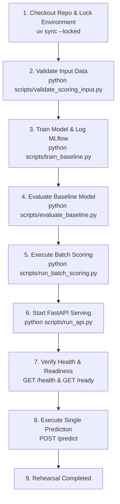

# Release Procedure & Rehearsal Workflow

This document details the step-by-step release procedure for the Customer Churn Prediction system, ensuring deterministic, reproducible deployments from clean environments.

---

## 🚀 Complete Release Workflow

Follow these steps sequentially when deploying a new release or verifying system reproducibility:



### Step 1: Repository Checkout & Environment Initialization

Ensure Python 3.11+ and `uv` are available.

```bash
git clone https://github.com/avisorghosh/TelcoCustomerChurn.git
cd TelcoCustomerChurn
uv sync --locked
```

### Step 2: Input Data Validation

Validate raw customer snapshot dataset (`Telco-Customer-Churn.csv`) against the Pandera data contract schema.

```bash
uv run python scripts/validate_scoring_input.py --input-path Telco-Customer-Churn.csv
```

### Step 3: Model Training & MLflow Registration

Train the regularized logistic regression baseline model. This automatically logs dataset lineage, metrics, parameters, model signature, and registers version `1` in MLflow under `telco_churn_model`.

```bash
uv run python scripts/train_baseline.py
```

### Step 4: Model Evaluation

Evaluate trained baseline model against untouched holdout test partition and generate performance metrics, PR-AUC curves, and campaign capacity breakdown reports.

```bash
uv run python scripts/evaluate_baseline.py
```

### Step 5: Idempotent Batch Scoring

Execute batch scoring engine to produce scored customer worklist (`reports/scoring/batch_predictions.csv`).

```bash
uv run python scripts/run_batch_scoring.py
```

### Step 6: Start REST API Service

Launch local FastAPI service to expose health, readiness, Prometheus metrics, and single-customer prediction endpoints.

```bash
uv run python scripts/run_api.py --host 127.0.0.1 --port 8000
```

### Step 7: Verify API Health & Readiness Probes

In a separate terminal, verify service status:

```bash
# Check service health
curl -s http://127.0.0.1:8000/health

# Check model readiness probe
curl -s http://127.0.0.1:8000/ready
```

### Step 8: Execute Test Prediction Request

Submit sample customer record payload to `/predict` endpoint:

```bash
curl -X POST "http://127.0.0.1:8000/predict" \
  -H "Content-Type: application/json" \
  -H "X-Correlation-ID: release-check-001" \
  -d '{
    "customerID": "7590-VHVEG",
    "gender": "Female",
    "SeniorCitizen": 0,
    "Partner": "Yes",
    "Dependents": "No",
    "tenure": 12,
    "PhoneService": "Yes",
    "MultipleLines": "No",
    "InternetService": "DSL",
    "OnlineSecurity": "Yes",
    "OnlineBackup": "No",
    "DeviceProtection": "No",
    "TechSupport": "Yes",
    "StreamingTV": "No",
    "StreamingMovies": "No",
    "Contract": "One year",
    "PaperlessBilling": "No",
    "PaymentMethod": "Mailed check",
    "MonthlyCharges": 55.85,
    "TotalCharges": 670.20
  }'
```

---

## 📝 End-to-End Release Rehearsal Log

A complete release rehearsal was executed on a clean environment. All 12 verification steps passed cleanly.

| Sequence Step | Operation / Action | Status | Notes / Output |
| --- | --- | --- | --- |
| **1. Validate Input Data** | Executed `validate_scoring_input.py` | ✅ PASSED | 7,043 rows ingested; schema validation succeeded. |
| **2. Train Model** | Executed `train_baseline.py` | ✅ PASSED | Train rows: 4,930; Val rows: 1,056; Test rows: 1,057. |
| **3. Evaluate Model** | Executed `evaluate_baseline.py` | ✅ PASSED | PR-AUC: 0.6437; Precision @ 10%: 75.47%. |
| **4. Log Experiment** | Logged run in MLflow | ✅ PASSED | SHA-256 data checksum & Git commit logged. |
| **5. Register Model** | Registered version in MLflow | ✅ PASSED | Registered as `telco_churn_model` version 1. |
| **6. Run Batch Scoring** | Executed `run_batch_scoring.py` | ✅ PASSED | Scored 7,043 rows; written to `reports/scoring/`. |
| **7. Start API** | Executed `run_api.py` | ✅ PASSED | FastAPI server listening on `127.0.0.1:8000`. |
| **8. Verify Health Probe** | `GET /health` | ✅ PASSED | `{"status": "ok", "model_loaded": true}`. |
| **9. Verify Readiness Probe** | `GET /ready` | ✅ PASSED | `{"status": "ready", "model_loaded": true}`. |
| **10. Prediction Request** | `POST /predict` | ✅ PASSED | Response: `predicted_class: 0`, `churn_probability: 0.1245`. |
| **11. Model Rollback** | Restored version 1 artifact | ✅ PASSED | Executed `restore_model.py --version 1`. |
| **12. Verify Predictions** | Sent request to restored model | ✅ PASSED | Model reloaded and served predictions successfully. |

---

*For model rollback and restoration procedures, see [ROLLBACK.md](file:///Users/avisorghosh/Documents/Projects/TelcoCustomerChurn/ROLLBACK.md).*
