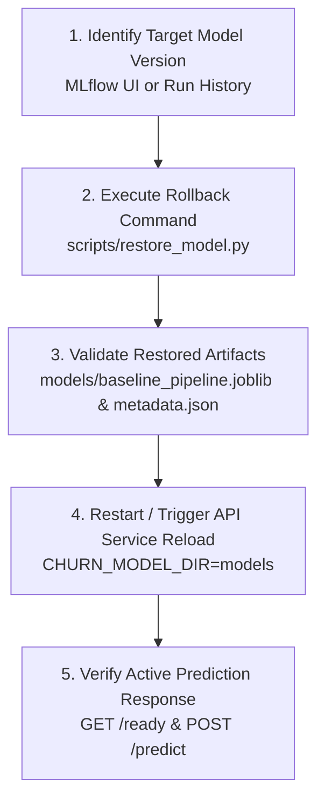

# Model Rollback Procedure

This document specifies the operational procedure for rolling back an active production model to a previously registered model version or local backup artifact without retraining.

---

## 🎯 Rollback Objectives

- Restore previously validated model artifacts (`.joblib` pipeline and `.json` metadata) into the active serving directory (`models/`).
- Perform rollback deterministically without retraining the model from scratch.
- Reload the API service and verify that predictions match the restored model version.

---

## 🔄 Step-by-Step Rollback Workflow



### 1. Identify Target Model Version

Locate the desired model version number to restore.

**Option A: Via MLflow Tracking UI**
```bash
uv run mlflow ui --port 5000
```
Open `http://127.0.0.1:5000`, navigate to **Models** -> `telco_churn_model`, and identify the target version number (e.g. `1`).

**Option B: Via Python CLI / Script**
```bash
uv run python -c "
import mlflow
client = mlflow.tracking.MlflowClient()
for mv in client.search_model_versions(\"name='telco_churn_model'\"):
    print(f'Version: {mv.version}, Stage: {mv.current_stage}, RunID: {mv.run_id}')
"
```

---

### 2. Execute Restoration Command

#### Method 1: Restore from MLflow Model Registry (Recommended)

Run the dedicated restoration script specifying the target MLflow registered version:

```bash
# Restore version 1 from MLflow model registry into active models/ directory
uv run python scripts/restore_model.py --version 1
```

#### Method 2: Restore from Local Backup Directory

If restoring from a saved local backup folder (e.g. `models/backup_v1/`):

```bash
uv run python scripts/restore_model.py --source-dir models/backup_v1
```

---

### 3. Validate Restored Model Artifacts

Verify that active artifacts in `models/` have been updated and are valid:

```bash
# Verify file existence
ls -la models/baseline_pipeline.joblib models/baseline_metadata.json

# Check restored metadata
cat models/baseline_metadata.json
```

---

### 4. Restart or Reload API Service

If the API service is running, restart it to load the restored model artifacts from `models/`:

```bash
# Stop existing server process (Ctrl+C or kill process)
# Restart API server
uv run python scripts/run_api.py --host 127.0.0.1 --port 8000
```

If running inside Docker:

```bash
docker restart churn-api
```

---

### 5. Verify Successful Rollback

Confirm that service readiness probe returns `200 OK` and predictions reflect the restored model version:

```bash
# 1. Readiness probe check
curl -s http://127.0.0.1:8000/ready

# 2. Submit test prediction request
curl -X POST "http://127.0.0.1:8000/predict" \
  -H "Content-Type: application/json" \
  -H "X-Correlation-ID: rollback-verify-001" \
  -d '{
    "customerID": "7590-VHVEG",
    "gender": "Female",
    "SeniorCitizen": 0,
    "Partner": "Yes",
    "Dependents": "No",
    "tenure": 12,
    "PhoneService": "Yes",
    "MultipleLines": "No",
    "InternetService": "DSL",
    "OnlineSecurity": "Yes",
    "OnlineBackup": "No",
    "DeviceProtection": "No",
    "TechSupport": "Yes",
    "StreamingTV": "No",
    "StreamingMovies": "No",
    "Contract": "One year",
    "PaperlessBilling": "No",
    "PaymentMethod": "Mailed check",
    "MonthlyCharges": 55.85,
    "TotalCharges": 670.20
  }'
```

Verify that response payload contains `model_version` matching the restored version and returns valid prediction probabilities.
